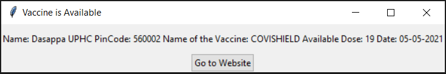

# Vaccine Alert Code
Code will give you a pop-up when the vaccine is available in your area. 
Make sure that script should run continuously in background  
Guided with Windows operating system  

# Option 1: (Simplest exe file)
In this option you don't need any installation of python. 
- Step 1: Download just code.exe file from repository 
- Step 2: Run code.exe file 
- Step 3: Give proper input of pincode and age. Put it in a backgroud 
- Step 4: Pop-up will come with available centres  
 

# Option 2: (With Python)
## How to run this code in your system?
Download code folder from repository 
In this python code, when slot available it will give you sound alert.

### Install basic library needed to run this code
- Step 1: Open terminal in the present working directory[where requirements.txt file present]
- Step 2: Run following command:  "pip install -r requirements.txt"

### Finally run code
- Double click on "code.py".
- Give proper input of pincode and age. Put it in a backgroud
- Don't close black window which was started in previous step.
- Now do your other work, Pop-up shown below image will come to your screen when the vaccine

##### References: 
https://apisetu.gov.in/public/marketplace/api/cowin

@ author: Kishan Vaishnani
