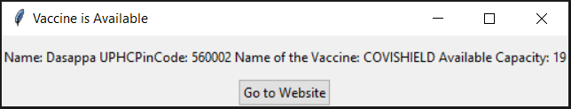

# Vaccine Alert Code
Code will give you a pop-up when the vaccine is available in your area. 
Make sure that script should run continuously in background  
Guided with Windows operating system 

## How to run this code in your system?
### If you haven't installed python yet?
Exe file download link: https://www.python.org/ftp/python/3.9.5/python-3.9.5-amd64.exe  
Ref: https://www.python.org/

After downloading the Exe file, then you can run the .exe file and make python install on your system.

### Install basic library needed to run this code
- Step 1: Open terminal in the present working directory[where requirements.txt file present]
- Step 2: Run following command:  '''pip install -r requirements.txt'''

### Finally run code
- Open code.py using editor like Notepad and do following changes:
    - **Pin_code = [] : Write all the pincode for which you want check with comma seperated between []. e.g Pin_code=[395009,395006] or Pin_code=[395009]**
    - Age_limit = 18 or 45; As per today's date government is providing only 2 age limits so that I provided accordingly.
    - sleep_time = 60; After every 60 sec it will check availability of vaccine.
	- How_many_days = 2 ; Starting from today, how many days you want to check? eg: 3, Code will check of Today, Tomorrow, Day after Tomorrow
- Double click on "code.py".
- Don't close black window which was started in previous step.
- Now do your other work, Pop-up shown below image will come to your screen when the vaccine

##### References: 
https://apisetu.gov.in/public/marketplace/api/cowin

@ author: Kishan Vaishnani
